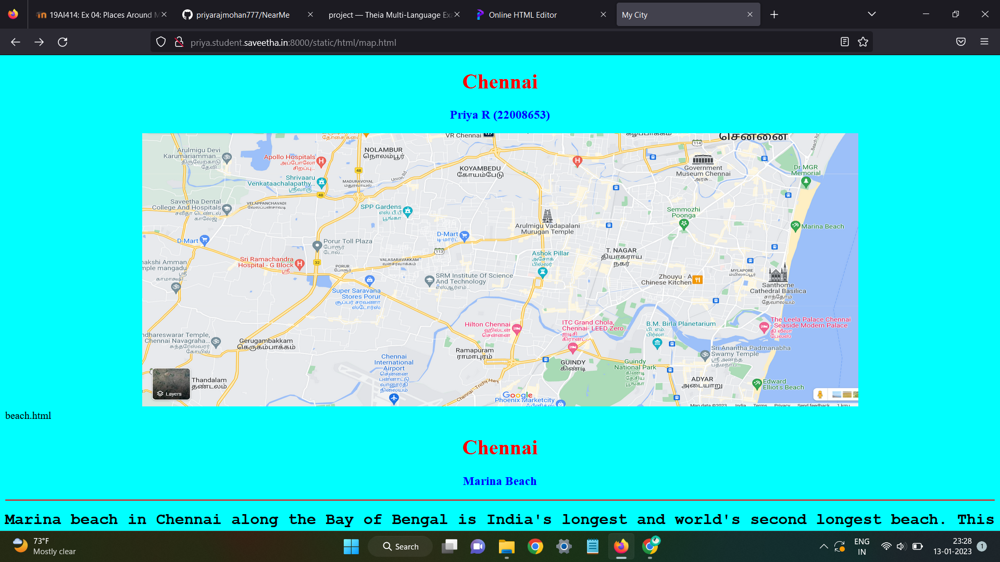
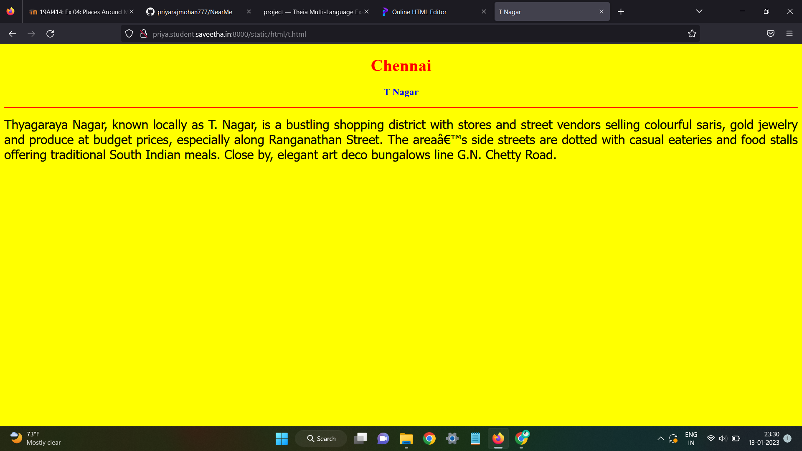
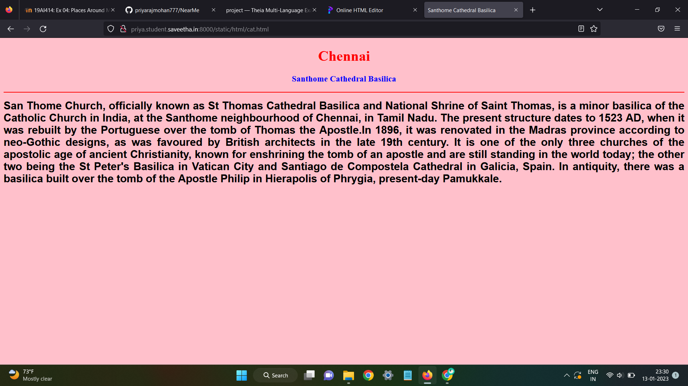
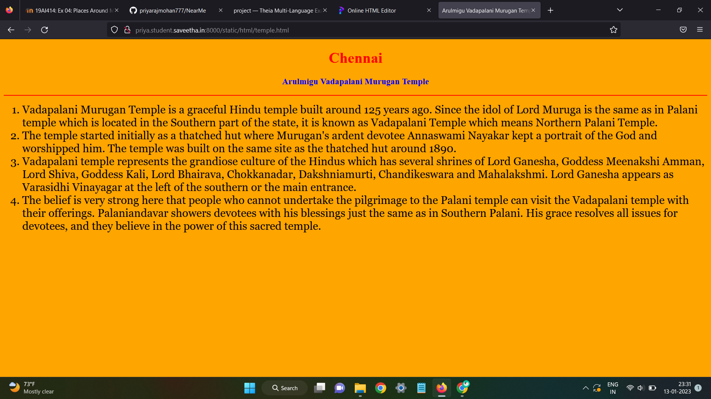
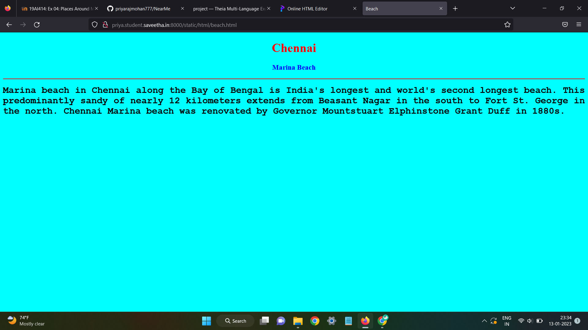
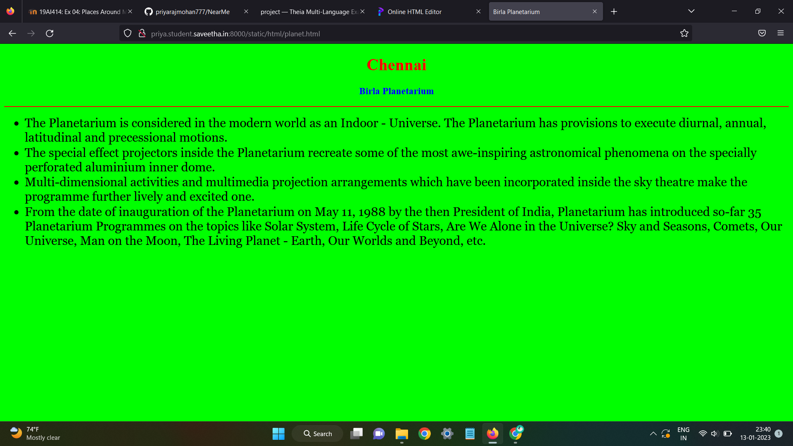
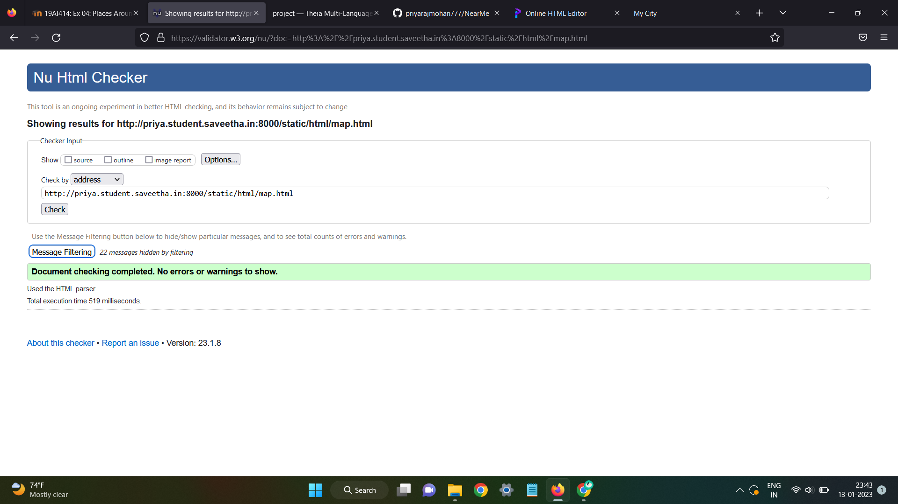

# Places Around Me
## AIM:
To develop a website to display details about the places around my house.

## Design Steps:

### Step 1:
Clone the github repository into Theia IDE.

### Step 2:
Create a new Django project.

### Step 3:
Write the needed HTML code.

### Step 4:
Run the Django server and execute the HTML files.

## Code:
```
map.html
<!DOCTYPE html>
<html lang="en">
<head>
<title>My City</title>
</head>
<body>
<h1 align="center">
<font color="red"><b>Chennai </b></font>
</h1>
<h3 align="center">
<font color="blue"><b>Priya R (22008653)</b></font>
</h3>
<center>

<map name="MyCity">
<area shape="circle" coords="190,50,20" href="/static/html/planet.html" title="Birla Planetarium">
<area shape="rectangle" coords="230,30,260,60" href="/static/html/cat.html" title="Santhome Cathedral Basilica">
<area shape="circle" coords="400,350,50" href="/static/html/temple.html" title="Arulmigu Vadapalani Murugan Temple">
<area shape="circle" coords="400,200,75" href="/static/html/beach.html" title="Marina Beach">
<area shape="rectangle" coords="490,150,870,320" href="/static/html/t.html" title="T Nagar">
</map>
</center>
</body>
</html>

beach.html
<!DOCTYPE html>
<html lang="en">
<head>
<title>Beach</title>
</head>
<body bgcolor="cyan">
<h1 align="center">
<font color="red"><b>Chennai</b></font>
</h1>
<h3 align="center">
<font color="blue"><b>Marina Beach</b></font>
</h3>
<hr size="3" color="red">
<p align="justify">
<font face="Courier New" size="5">
<b>
Marina beach in Chennai along the Bay of Bengal is India's longest and world's second longest beach. This predominantly sandy of nearly 12 kilometers extends from Beasant Nagar in the south to Fort St. George in the north. Chennai Marina beach was renovated by Governor Mountstuart Elphinstone Grant Duff in 1880s.
</b>
</font>
</p>
</body>
</html>

t.html
<!DOCTYPE html>
<html lang="en">
<head>
<title>T Nagar</title>
</head>
<body bgcolor="yellow">
<h1 align="center">
<font color="red"><b>Chennai</b></font>
</h1>
<h3 align="center">
<font color="blue"><b>T Nagar</b></font>
</h3>
<hr size="3" color="red">
<p align="justify">
<font face="Tahoma" size="5">
Thyagaraya Nagar, known locally as T. Nagar, is a bustling shopping district with stores and street vendors selling colourful saris, gold jewelry and produce at budget prices, especially along Ranganathan Street. The area’s side streets are dotted with casual eateries and food stalls offering traditional South Indian meals. Close by, elegant art deco bungalows line G.N. Chetty Road.
</font>
</p>
</body>
</html>

<!DOCTYPE html>
<html lang="en">
<head>
<title>Santhome Cathedral Basilica</title>
</head>
<body bgcolor="pink">
<h1 align="center">
<font color="red"><b>Chennai</b></font>
</h1>
<h3 align="center">
<font color="blue"><b>Santhome Cathedral Basilica</b></font>
</h3>
<hr size="3" color="red">
<p align="justify">
<font face="Arial" size="5">
<b>
San Thome Church, officially known as St Thomas Cathedral Basilica and National Shrine of Saint Thomas, is a minor basilica of the Catholic Church in India, at the Santhome neighbourhood of Chennai, in Tamil Nadu. The present structure dates to 1523 AD, when it was rebuilt by the Portuguese over the tomb of Thomas the Apostle.In 1896, it was renovated in the Madras province according to neo-Gothic designs, as was favoured by British architects in the late 19th century. It is one of the only three churches of the apostolic age of ancient Christianity, known for enshrining the tomb of an apostle and are still standing in the world today; the other two being the St Peter's Basilica in Vatican City and Santiago de Compostela Cathedral in Galicia, Spain. In antiquity, there was a basilica built over the tomb of the Apostle Philip in Hierapolis of Phrygia, present-day Pamukkale. 
</b>
</font>
</p>
</body>
</html>

planet.html
<!DOCTYPE html>
<html lang="en">
<head>
<title>Birla Planetarium</title>
</head>
<body bgcolor="lime">
<h1 align="center">
<font color="red"><b>Chennai</b></font>
</h1>
<h3 align="center">
<font color="blue"><b>Birla Planetarium</b></font>
</h3>
<hr size="3" color="red">
<p align="justify">
<font face="Georgia" size="5">
<ul>
<li>The Planetarium is considered in the modern world as an Indoor - Universe. The Planetarium has provisions to execute diurnal, annual, latitudinal and precessional motions.</li>
<li>The special effect projectors inside the Planetarium recreate some of the most awe-inspiring astronomical phenomena on the specially perforated aluminium inner dome.</li>
<li>Multi-dimensional activities and multimedia projection arrangements which have been incorporated inside the sky theatre make the programme further lively and excited one.</li>
<li>From the date of inauguration of the Planetarium on May 11, 1988 by the then President of India, Planetarium has introduced so-far 35 Planetarium Programmes on the topics like Solar System, Life Cycle of Stars, Are We Alone in the Universe? Sky and Seasons, Comets, Our Universe, Man on the Moon, The Living Planet - Earth, Our Worlds and Beyond, etc.</li>
</ul>
</font>
</p>
</body>
</html>

temple.html
<!DOCTYPE html>
<html lang="en">
<head>
<title>Arulmigu Vadapalani Murugan Temple</title>
</head>
<body bgcolor="orange">
<h1 align="center">
<font color="red"><b>Chennai</b></font>
</h1>
<h3 align="center">
<font color="blue"><b>Arulmigu Vadapalani Murugan Temple</b></font>
</h3>
<hr size="3" color="red">
<p align="justify">
<font face="Georgia" size="5">
<ol type="1">
<li> Vadapalani Murugan Temple is a graceful Hindu temple built around 125 years ago. Since the idol of Lord Muruga is the same as in Palani temple which is located in the Southern part of the state, it is known as Vadapalani Temple which means Northern Palani Temple.</li>
<li>The temple started initially as a thatched hut where Murugan's ardent devotee Annaswami Nayakar kept a portrait of the God and worshipped him. The temple was built on the same site as the thatched hut around 1890.</li>
<li>Vadapalani temple represents the grandiose culture of the Hindus which has several shrines of Lord Ganesha, Goddess Meenakshi Amman, Lord Shiva, Goddess Kali, Lord Bhairava, Chokkanadar, Dakshniamurti, Chandikeswara and Mahalakshmi. Lord Ganesha appears as Varasidhi Vinayagar at the left of the southern or the main entrance.</li>
<li>The belief is very strong here that people who cannot undertake the pilgrimage to the Palani temple can visit the Vadapalani temple with their offerings. Palaniandavar showers devotees with his blessings just the same as in Southern Palani. His grace resolves all issues for devotees, and they believe in the power of this sacred temple. </li>
</ol>
</font>
</p>
</body>
</html>
```

## Output:












### HTML Validator


## Result:
The program for implementing image map is executed successfully